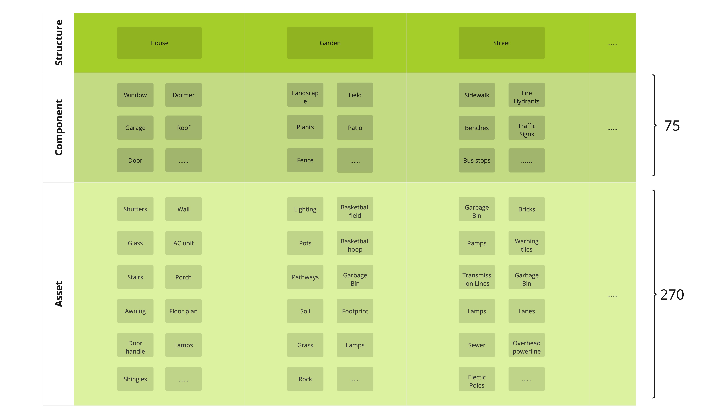

# 🖐 Home

## Introduction to OPUS

<figure><figcaption></figcaption></figure>

### What is OPUS?

OPUS is a service that enables you to create your own parametrizable high-quality 3D assets for use in simulations, games, or any other application. We offer many configurations and multi degrees-of-freedom. Our endpoints are designed for granular configurations, but we also support controlled-randomization for those who want to randomize parameters easily.

In this tutorial, we'll cover how to randomize different objects at various levels of control.

### What is a Component?

#### Definition:

A component refers to an individual or standalone part that can be used to build or assemble larger objects.

#### Key Points:

* **Granularity**: Components are often smaller elements with a specific purpose or function.
* **Independence**: They can exist independently or be integrated into larger structures.
* **Examples**: Windows, doors, stairs, antennas, fire hydrants, and parking meters.
* **Function**: Components typically serve specific roles. For instance, a door allows for entry and exit, while a window lets in light.

### What is a Structure?

#### Definition:

A structure refers to a more complex assembly made up of multiple components. It represents a higher-level entity that houses various components in an organized manner.

#### Key Points:

* **Complexity**: Structures are comprehensive entities comprising multiple components.
* **Composition**: By nature, structures combine multiple components. For example, a house may include windows, doors, and stairs.
* **Examples**: A house is a primary example of a structure in the context of 3D modeling.
* **Purpose**: Structures often serve broader purposes. A house, for example, provides shelter, while its components serve specific functions within that shelter.

To put it succinctly, while components are individual parts or elements that can be used independently or as part of larger assemblies, structures are those larger entities that group and organize multiple components. Grasping this distinction is essential for effective 3D design, especially when using a tool like OPUS.

###

## Appendix: Additional Tutorials

For those looking to delve deeper into the subject of creating components and structures, the following tutorials provide comprehensive insights, starting from the basics (A) to the advanced techniques (Z).

### Tutorials:

1. **Fundamentals of Creating Components and Structures**
   * [Creating Models from A-Z](tutorial1.md)

## Appendix: Change Logs

Throughout our software's development, several pivotal updates have been implemented to enhance functionality, improve user experience, and rectify previous limitations. Here's a summary of some of our most impactful changes along with links to detailed changelog files:

###

***

To stay updated of the latest features and improvements, we recommend reviewing our change logs regularly.
