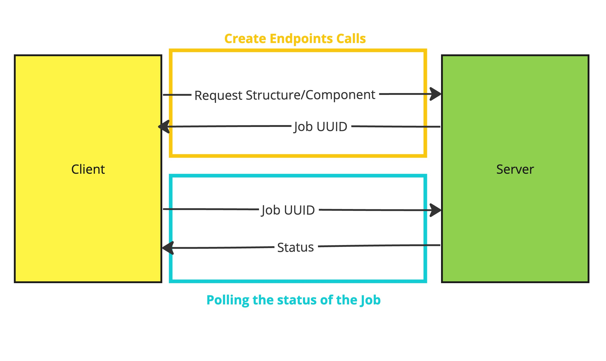

# ⏺ Endpoints

### Summary of workflow&#x20;

Pick any model name from **Get All Model Names** endpoint. -> Then check customizable parameters of your selection using "**Get Attributes of a Model"** endpoint. -> Use "**Create Component**" or "**Create Structure**" endpoints to generate 3D model. -> Use "**Get Job Result**" endpoint to grab download link of generated 3D model. Thats all!&#x20;

### 1 - Fetch all supported objects

Use the **Get All Model Names** endpoint to retrieve a list of currently available models. Models are divided into two categories: "Structure" and "Component". Structures are larger objects comprising multiple components.

### 2 - Getting Model Attributes

After choosing your desired model, use the **Get Attributes of a Model** endpoint to retrieve its attributes, which are divided into "keywords" and "parameters".

### 3.a - Creating a Structure

This endpoint disabled temporarily. Please follow&#x20;

You can request either a fully or partially randomized structure using the **Create Structure** endpoint.

* For a totally randomized "House" with simple window components.
* For a large "House" with all large components.
* For more specific structures, like a generally small "House" but with large windows.

You can also specify exact parameter values.

### 3.b - Create Components

Components are the smaller objects that constitute a structure. Like structures, components can also be created by controlling either keywords, parameters, or both.

For example, to create a window with specific dimensions.

### Texture Resolution

Specify your preferred texture resolution using the `texture_resolution` option. Options include 1024, 2048, and 4096.

### Getting Job Results

We use an asynchronous request pattern. Each **Create Component** or **Create Structure** call will return a job ID, which you can use to check the status of your request.

Job statuses include:

* **PENDING**: Job hasn't started.
* **IN\_PROGRESS**: Job is currently in process.
* **COMPLETED**: Job has finished successfully.
* **FAILED**: Job has failed.
* **CANCELLED**: Job has been cancelled.

In the event of a failure, please provide the timestamp of the request and contact [genel@capoom.com](mailto:genel@capoom.com) for a quota increase.

Please begin polling status after a 30-second wait for structures and 15 seconds for components. Download links expire in 24 hours, so caching is recommended for frequent access.

**Happy developing with our OPUS APIs!** For support and suggestions, please email [genel@capoom.com](mailto:genel@capoom.com).

